# Complete Storyteller Workflow Flowchart

Complete workflow diagram showing the full Storyteller pipeline, including optional script generation (LLM/Chat API + browser research) and the core orchestration workflow.

```mermaid
flowchart LR
    Start([Start]):::startEnd --> HasScript{Script exists?}:::decision
    HasScript -->|No| NeedGen{Generate script?}:::decision
    NeedGen -->|No| Manual[Create manually]:::process --> SaveScript[Save script]:::process --> Parse
    NeedGen -->|Yes| Research{Research enabled?}:::decision
    Research -->|Yes| Browser[Browser Research]:::process --> LLM[LLM Generate Script]:::process --> SaveScript
    Research -->|No| LLM
    HasScript -->|Yes| Parse[Parse & Extract]:::process
    SaveScript --> Parse
    Parse --> Filter[Filter Scenes]:::process
    Filter --> CheckScenes{Scenes?}:::decision
    CheckScenes -->|No| ReturnEmpty[Return Empty]:::output --> EndSuccess([End]):::startEnd
    CheckScenes -->|Yes| Init[Init Stats & Timer]:::process
    Init --> Loop{For each scene}:::decision
    Loop -->|More| GetDir[Get Output Dir]:::process
    GetDir --> CheckSkip{Skip existing?}:::decision
    CheckSkip -->|Yes| CheckExists{Output exists?}:::decision
    CheckExists -->|Yes| Skip[Skip]:::process --> Loop
    CheckSkip -->|No| Process[Process Scene]:::process
    CheckExists -->|No| Process
    Process --> Success{Success?}:::decision
    Success -->|Yes| Complete[Complete++]:::process --> Loop
    Success -->|No| Error2[Catch Error]:::error --> Continue{continue_on_error?}:::decision
    Continue -->|Yes| AskUser{User continue?}:::decision
    AskUser -->|Yes| Loop
    AskUser -->|No| Break[Break]:::error
    Continue -->|No| Break
    Loop -->|Done| Summary[Print Summary]:::process --> Return[Return Stats]:::output --> EndSuccess
    
    classDef startEnd fill:#E8F5E9,stroke:#4CAF50,stroke-width:2px,color:#1B5E20,font-weight:500
    classDef input fill:#E3F2FD,stroke:#2196F3,stroke-width:2px,color:#0D47A1,font-weight:500
    classDef process fill:#F3E5F5,stroke:#9C27B0,stroke-width:2px,color:#4A148C,font-weight:500
    classDef decision fill:#FFF3E0,stroke:#FF9800,stroke-width:2px,color:#E65100,font-weight:500
    classDef output fill:#E8F5E9,stroke:#4CAF50,stroke-width:2px,color:#1B5E20,font-weight:500
    classDef error fill:#FFEBEE,stroke:#F44336,stroke-width:2px,color:#B71C1C,font-weight:500
    classDef llm fill:#FFF9C4,stroke:#FBC02D,stroke-width:2px,color:#F57F17,font-weight:500
    
    class LLM llm
    class Browser llm
```

## Workflow Steps

### Phase 1: Script Creation (Optional)
**LLM/Chat API Integration - Only used here**

1. **Check for Existing Script**
   - If script exists, skip to parsing
   - If not, decide: generate or create manually

2. **Script Generation (Optional)**
   - **Research Phase** (Optional): Browser automation gathers current information
   - **LLM Generation**: Chat API creates complete script from topic + research
   - Save generated script to file

3. **Manual Creation (Alternative)**
   - Use templates/guides to create script manually
   - Save script to file

**Note:** After script is created, LLM is no longer used. All data comes from the script file.

### Phase 2: Script Processing
**Core Framework - No LLM needed**

1. **File Parsing**
   - Parse explainer file to extract metadata and scenes
   - Parser extracts: narration, prompts, scene data, layout instructions
   - Filter scenes by scene_numbers if specified

2. **Main Processing Loop**
   For each scene:
   - Get output directory path
   - Check if output already exists (if skip_existing enabled)
   - Process scene with user-provided function (image generation, audio, etc.)
   - Handle success/failure

3. **Error Handling**
   - Catch exceptions during processing
   - If continue_on_error enabled, ask user to continue
   - Track failed scenes in statistics

4. **Completion**
   - Calculate elapsed time
   - Print summary statistics
   - Return statistics dictionary

## Key Decision Points

### Script Generation Phase
1. **Script Exists?** → If yes, skip to parsing. If no, decide generation method
2. **Generate Script?** → Use LLM/Chat API or create manually
3. **Research Enabled?** → If yes, use browser automation before LLM generation

### Processing Phase
1. **Scenes Empty** → Return empty stats immediately
2. **Skip Existing** → Skip scenes with existing output
3. **Processing Success** → Increment completed counter
4. **Error Handling** → Continue or stop based on continue_on_error flag

## LLM/Chat API Scope

**Important:** LLM/Chat API is **only** used in Phase 1 (Script Generation):
- Browser research (optional)
- Script writing/generation

After script is saved, the parser extracts all data from the script file. No LLM calls are made during:
- Scene parsing
- Image prompt extraction
- Narration extraction
- Layout pattern selection
- Scene processing

## Output

Returns a dictionary with:
- `total`: Total number of scenes processed
- `completed`: Successfully processed scenes
- `skipped`: Scenes skipped (existing output)
- `failed`: Scenes that failed processing
- `elapsed_time`: Total processing time in seconds

